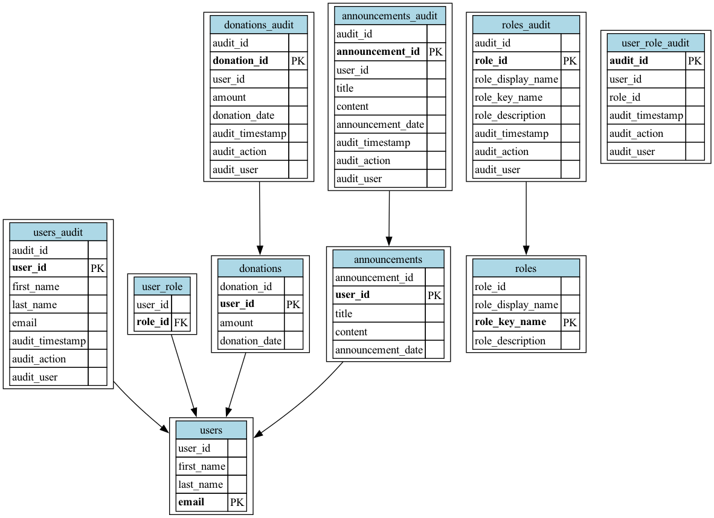

# Architecture Diagrams

This document outlines the architecture of the Community Hub project, focusing on the database schema and its relationships.

## Database Schema Diagram

The following diagram represents the Entity Relationship Diagram (ERD) of the database schema defined in the `liquibase/changelog/1.0.0.yaml` file.



### Generating the Schema Image

To generate the schema image, you will need Python 3 and the `graphviz` library installed.

1. **Install Graphviz:**

   * **Windows:** Download and install the Graphviz binaries from the official website: [https://graphviz.org/download/](https://graphviz.org/download/). Add the Graphviz `bin` directory to your system's PATH environment variable.
   * **macOS:** Use Homebrew: `brew install graphviz`
   * **Linux (Debian/Ubuntu):** `sudo apt-get install graphviz`
   * **Linux (Fedora/CentOS):** `sudo dnf install graphviz`

2. **Install Python Libraries:**

   ```bash
   pip install graphviz
   ```

3. **Run the Script

   ```bash
   python generate_erd.py
   ```